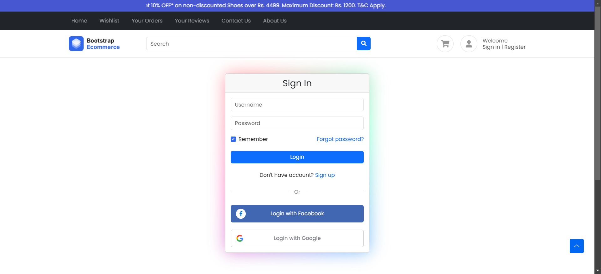
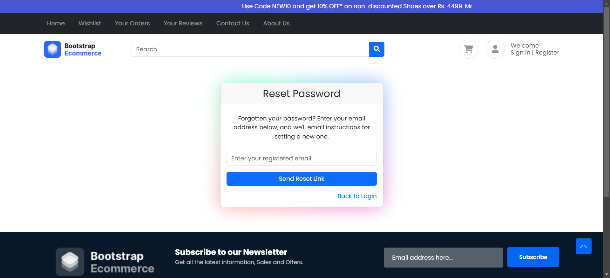
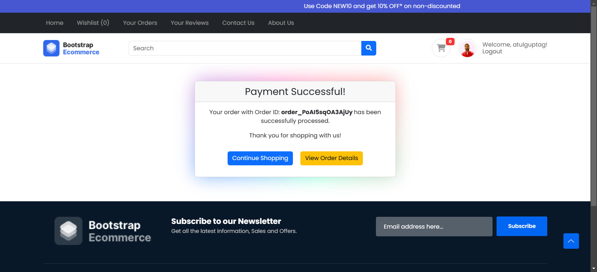
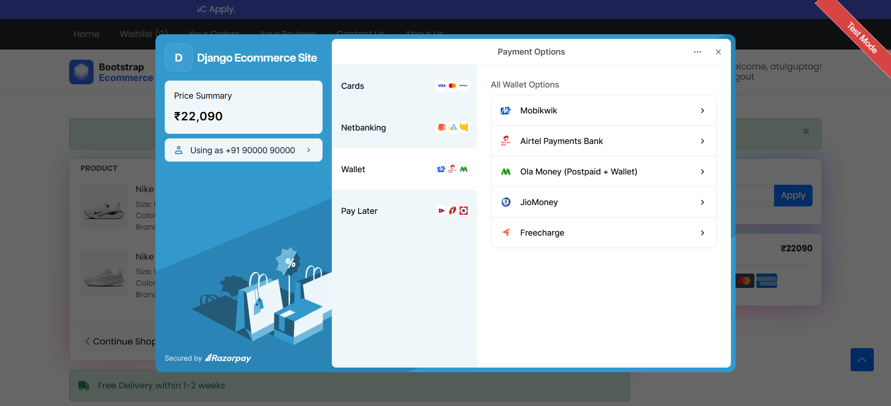
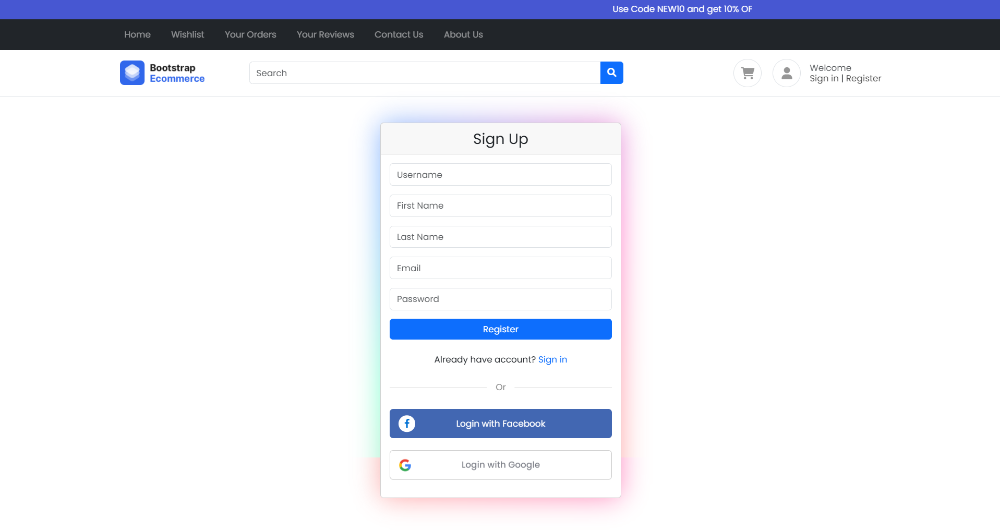
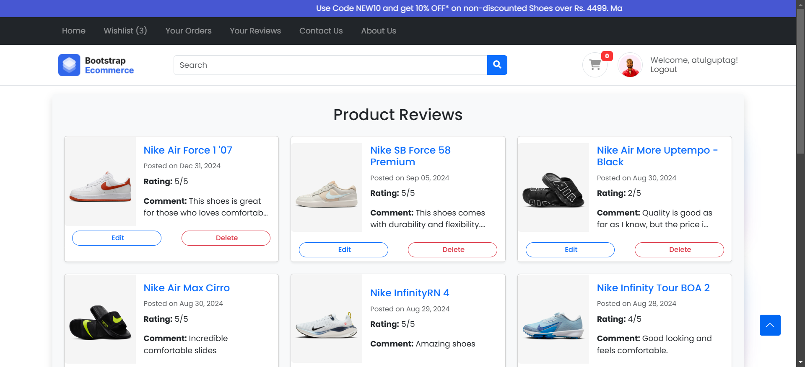
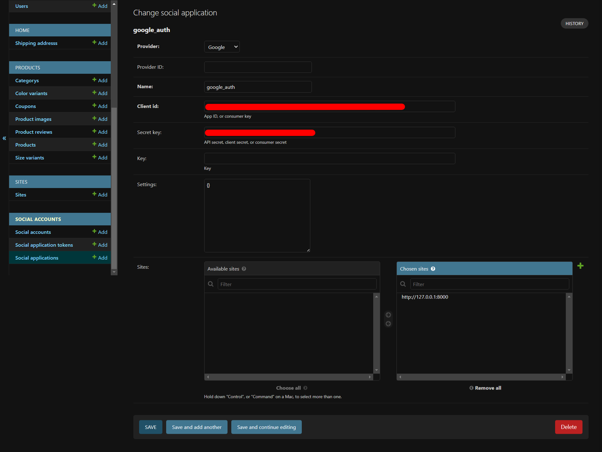

# 🛍️ Django E-Commerce Website

An e-commerce web application built with **Django**, supporting product browsing, cart management, and checkout with Razorpay integration (UPI, Google Pay, Cards, Netbanking).

---

## 🚀 Features

- 👤 User Authentication (Register/Login/Logout with email verification)  
- 📦 Product Management with Categories, Variants, and Images  
- 🛒 Cart & Wishlist functionality  
- 🔍 Product Search and Filtering  
- 💳 Secure Payment Integration with Razorpay (supports GPay/UPI, Cards, Netbanking, Wallets)  
- 📊 Admin Dashboard for Product and Order Management  
- 📱 Responsive Design (Bootstrap 5)  

---

## 🖼️ Screenshots  

You can add your project screenshots in a `screenshots/` folder and reference them here.  

### Home Page  
  

### Login Page
  

### Order Details
  

### Order History
  

### Change Paasword
  

### Password Reset Form
  

### Payment Successful
  

### Payment Testing View
  

### Product Image
  

### Register Page
  

### Reviews 
  

### Admin Page
  

### Cart Page  
  

### Wishlist Page  
  

---

## 🛠️ Tech Stack  

- **Backend**: Django, Python  
- **Frontend**: HTML5, CSS3, Bootstrap, JavaScript  
- **Database**: SQLite (default) / MySQL / PostgreSQL  
- **Payments**: Razorpay Integration (GPay/UPI, Cards, Netbanking)  

---

## ⚙️ Installation & Setup  

1. **Clone the repository**  
   ```bash
   git clone https://github.com/your-username/django-ecommerce.git
   cd django-ecommerce

---
2. **Create a virtual environment & activate it**  
   ```bash
   python -m venv venv
   venv\Scripts\activate   
---
3. **Install dependencies**  
   ```bash
   pip install -r requirements.txt

---
4. **Set up database**  
   ```bash
   python manage.py migrate

---
5. **Create superuser (for admin dashboard)**  
   ```bash
   python manage.py createsuperuser

---
6. **Run the server**  
   ```bash
   python manage.py runserver
---

7 **Visit http://127.0.0.1:8000/**
  and deploy


